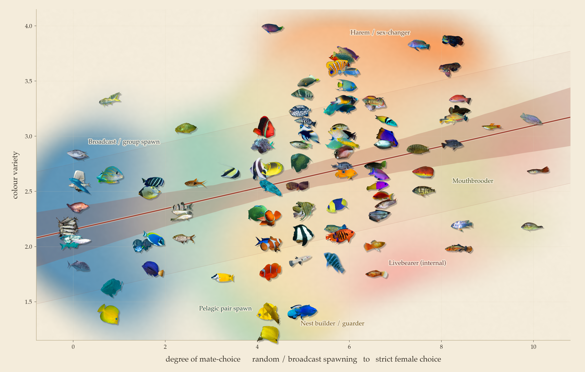

# Does mate choice make fish beautiful?

A quantitative test of the thesis in the essay *"Fish art"*: **does sexual selection
(mate choice) make fish more visually striking?** We pair an expert, behaviour-only
**mate-choice score** with **computer-vision striking-ness metrics** measured on
background-removed photographs of 156 species.



### ▶ [Swim around in the gallery](https://yitongtseo.github.io/FishArt/)

The figure above, but alive: **scroll to zoom, drag to pan, hover any fish** to get its name,
family, mating behaviour and every score behind its position — click to pin the card, search
for a species, or mute a mating behaviour to see what the rest of the plane looks like without
it. Linkable per fish, too: [#Synchiropus_splendidus](https://yitongtseo.github.io/FishArt/#Synchiropus_splendidus)
drops you on the mandarinfish.

## Headline result

**Yes — but only for colour *variety*, not raw brightness.** Mate-choosy species wear a
greater diversity of hues (Spearman ρ = **+0.31, p < 0.001**), and the effect **survives
phylogenetic correction** (PGLS p = 0.011) — so it is not merely an artifact of a few
colourful lineages. Raw colorfulness and saturation do **not** track mate choice, and the
apparent body-shape effects vanish once phylogeny is controlled.

`FINDINGS.md` tells the full and honest story, **including where the result weakens** — it
does not hold in the small, reef-skewed sex-annotated subset. Read that before citing this.

---

## The dataset

### 1. The X axis — a mate-choice index (the human-curated part)

156 tropical and aquarium fish species (43 families), hand-scored in
[`experiment/fish_data.py`](experiment/fish_data.py). Each species gets four behavioural
sub-scores, 0–3 each, taken from **mating-system biology only — never from coloration**,
which is what keeps the test from being circular:

| component | 0 | 3 |
|---|---|---|
| `fert` — fertilisation / egg mode | broadcast or group spawn | internal, mouthbrooding, or male brooding |
| `court` — courtship elaboration | none | spectacular (lek dance, bower, nuptial flashing) |
| `system` — mating system | promiscuous mass spawn | polygynous lek / display arena |
| `choice` — strength of mate choice | negligible | textbook strong female choice |

`mate_choice_index = 10 × (fert + court + system + choice) / 12`, giving a 0–10 scale.
Because it is componentised it is auditable rather than a black box, and the species list
deliberately includes **trap cases** in both directions — gaudy fish that barely choose
(blue tang, yellow tang, cardinal tetra: brilliant, but aggregation spawners or
egg-scatterers) and drab fish that choose intensely (stickleback, seahorses). The test
cannot be rigged by picking pretty choosy fish.

The same four components also derive a discrete **mating behaviour** class — broadcast /
pelagic pair / nest-builder / harem–sex-changer / mouthbrooder / male brooder / livebearer —
which is what colours the background of the gallery figure.

### 2. The photographs

Up to **80 photos per species** from the **iNaturalist** observations API
(`inat.py`, `build_dataset.py`), cached to `data/images/` — about **9,400 images, 1.1 GB**.
Photo URLs are committed in `data/urls/` so the download is reproducible; the images
themselves are gitignored.

A secondary, sex-annotated set (`images_male/`, `images_female/`) is fetched for the
minority of species where iNaturalist observations carry a sex annotation — only 23–30
species qualify, which is why the sex-controlled analysis is underpowered.

### 3. The Y axis — striking-ness metrics

Every photo is background-removed, and 13 metrics are measured **on the fish pixels only**
(`features.py`), then aggregated per species by **median** (robust to a few bad frames).
The headline measure is:

> **`hue_entropy` — "colour variety"**: the Shannon entropy of the fish's hue histogram
> (30 bins over the hue circle), computed only over pixels with saturation > 0.15 so that
> grey/white body regions cannot masquerade as hue. High entropy = the fish wears **many
> different hues**; low entropy = one or two hues, however vivid.

This is the crucial distinction the result turns on: entropy measures *variety*, not
*intensity*. A brilliant monochrome yellow tang scores **low**; a mandarinfish scores high.
Other metrics (colorfulness, saturation, vivid-patch fraction, luminance contrast, edge
density, aspect ratio, body depth, solidity) are computed too and reported in
`fig2_all_measures.png` — none of them support the hypothesis.

### 4. Phylogeny

The Fish Tree of Life chronogram (Rabosky et al. 2018), `data/fishtree.nwk`; 126 of 156
species are placed on the tree. `phylo.py` runs **PGLS** (phylogenetic generalised least
squares) with an ML-estimated Pagel's λ, so shared ancestry is modelled in the covariance
rather than ignored. This is what separates the real colour-variety effect from the
body-shape artifacts.

### Data-quality rule

Figures use only the **species with ≥ 15 clean close-up images**, so that the per-species
median rests on real data. Species with 1–14 usable images are dropped. This is not
p-hacking in disguise: filtering them *strengthened* the signal (ρ = +0.19 → +0.31), which
is the direction you expect if the discarded species were measurement noise rather than
counter-evidence.

---

## Methods: segmentation, and why it matters most

The single biggest threat to this study is **not** sample size — it is the segmenter. If
the mask grabs coral instead of fish, you measure the colour variety of coral. That failure
mode already killed one iteration of this project (see `FINDINGS.md`: Endler's livebearer,
one of the most vivid fish alive, scored *lowest* colorfulness because GrabCut segmented
the aquarium wall).

**Metrics pipeline** (`segment.py`): rembg / U²-Net (`u2netp`) foreground masks, cached to
`data/masks/`, with close-up selection — among the ~80 photos per species, prefer the shots
where the fish fills more of the frame.

**Cut-outs for the gallery figure** (`make_cutouts.py`) need a much higher bar, because a
single bad cut-out is *visible*. One photo per species is chosen by a three-stage cascade:

1. **Prefilter** — rank all ~80 photos with the cheap cached `u2netp` masks, shortlist 12.
2. **Re-segment** — run `isnet-general-use` at 768 px on the shortlist (far better than
   `u2netp` at 400 px), cached to `data/masks_isnet/`.
3. **Score the shape, then veto with a classifier.**
   - *Shape gates* hard-reject the mask if it is rectangular, hugs three or more frame
     borders, eats the frame, is fragmented, or sprawls — this is what kills aquarium
     walls, whole-frame crops and coral. The soft shape preferences are kept deliberately
     broad, because angelfish are taller than they are long and a long-finned betta is
     nowhere near convex.
   - *The classifier veto* (`fishnet.py`) handles what shape cannot: a brain coral and a
     pufferfish are both compact convex blobs. An ImageNet ResNet-50 is asked whether the
     blob looks more like its **fish** classes or its **coral / anemone / urchin / diver**
     classes. Crucially this **re-picks a different photo of the same species** rather than
     dropping the species — the clown anemonefish went from being a picture of an anemone
     to being a picture of a clownfish.

A species whose every photo fails the bar gets **no cut-out at all** and is omitted from
the gallery. An absent fish is better than a picture of a glove. Per-species scores and the
chosen source photo are written to `cutout_quality.csv` so any individual pick is auditable.

**Known limitation, stated plainly:** a handful of cut-outs are still unlovely — the Pacific
sardine is a pile on a deck, the harlequin rasbora is in a tank, the bigeye scad is a bait
ball. Searching 40 candidate photos instead of 12 did not improve them: those species'
*entire* iNaturalist photo sets are fishery and aquarium shots. That is the source data, not
a bug in the pipeline.

---

## The gallery figure

`fig4_fish_gallery.py` → `fig4_fish_gallery.png`. Every datapoint **is** the fish: each
species' transparent cut-out is placed at its own (mate-choice, colour-variety) coordinate.

- **The background wash** encodes mating behaviour. It is a per-mode kernel density field;
  at each point on the canvas a mode's opacity is *its share of the local density*, so where
  one behaviour dominates the region reads as its colour, where behaviours mix the pigments
  mix, and where there are no fish it fades back to bare paper. Density is referenced to the
  90th percentile rather than the peak (otherwise the tight broadcast-spawner cluster at
  x = 0 sets the scale and bleaches everything else), and each mode is discounted by
  `count^0.5` so the 4 male-brooders still tint their corner instead of being buried under
  36 nest-builders.
- **Labels are placed in-plot**, computed rather than hand-tuned: for each mode, the point
  where it wins the colour contest, is furthest from any fish, and is closest to the heart of
  its own colour — with a repulsion term so labels don't stack.
- **The trend line** carries two bands: the 95% bootstrap CI of the line itself (inner
  ribbon) and the ±1 SD spread of species about it (faint outer veil).

---

## Reproducing

```bash
cd experiment
pip install -r requirements.txt

python build_dataset.py    # fetch ~9,400 iNaturalist photos  -> data/images/   (slow, ~1.1 GB)
python segment.py          # cache U^2-Net masks              -> data/masks/
python features.py         # 13 metrics/image, median/species -> fish_metrics.csv
python phylo.py            # PGLS with Pagel's lambda
python clean_figures.py    # fig1, fig2, fig3 + fish_quality.csv
python make_cutouts.py     # one vetted cut-out per species   -> data/cutouts/ (needs torch)
python fig4_fish_gallery.py
python build_web.py        # the same gallery, interactive    -> ../docs/  (served by GitHub Pages)
```

`build_web.py` needs nothing beyond the committed cut-outs and `fish_metrics.csv`, and it
recomputes the wash, the jitter, the trend and the label placement with the same seed and the
same call order as `fig4_fish_gallery.py` — so the web page *is* the figure, only walkable.
It writes `docs/`: the page, the background wash, 123 WebP cut-outs and one `data.json`
(1.9 MB all in). To serve it locally: `python -m http.server` from `docs/`.

The cut-outs in `data/cutouts/` **are committed**, so `fig4_fish_gallery.py` can be re-run
without the 1.1 GB image download. Everything else under `data/` is gitignored and
regenerable.

## Layout

| path | what |
|---|---|
| `fish_data.py` | the 156 species and their componentised mate-choice scores |
| `inat.py`, `build_dataset.py` | fetch and cache iNaturalist photos |
| `segment.py` | U²-Net masks + close-up selection (used by the metrics) |
| `features.py` | 13 striking-ness metrics per image → `fish_metrics.csv` |
| `phylo.py` | PGLS / Pagel's λ against the Fish Tree of Life |
| `sex_probe.py`, `fetch_sexed.py`, `sexed_analyze.py` | the sex-annotated subset and dichromatism |
| `clean_figures.py` | the three analytical figures |
| `make_cutouts.py`, `fishnet.py` | vetted cut-outs for the gallery |
| `artsy_fig1.py`, `fig4_fish_gallery.py` | the two figures for the essay |
| `build_web.py` → `docs/` | the interactive gallery (zoom / pan / hover), published by GitHub Pages |
| `FINDINGS.md` | full results, iteration by iteration, including the negative ones |
| `BRAINSTORM_Yaxes.md` | every striking-ness measure considered, and why |
| `archive/` | superseded iteration-1/2 scripts and figures |

## Caveats worth knowing before you trust this

- iNaturalist photos mix **sexes, juveniles and feral wild-types**. For sexually dimorphic
  species the showy males — the whole point of the hypothesis — are diluted by drab females.
  This systematically *weakens* the effect being tested.
- The mate-choice score is expert judgement, not measurement. It is auditable
  (`fish_data.py` shows all four components per species) but it is still a judgement.
- The effect is **modest**. Sexual selection looks like *one* of several colour drivers —
  crypsis, aposematism, species recognition and habitat light all compete with it.
